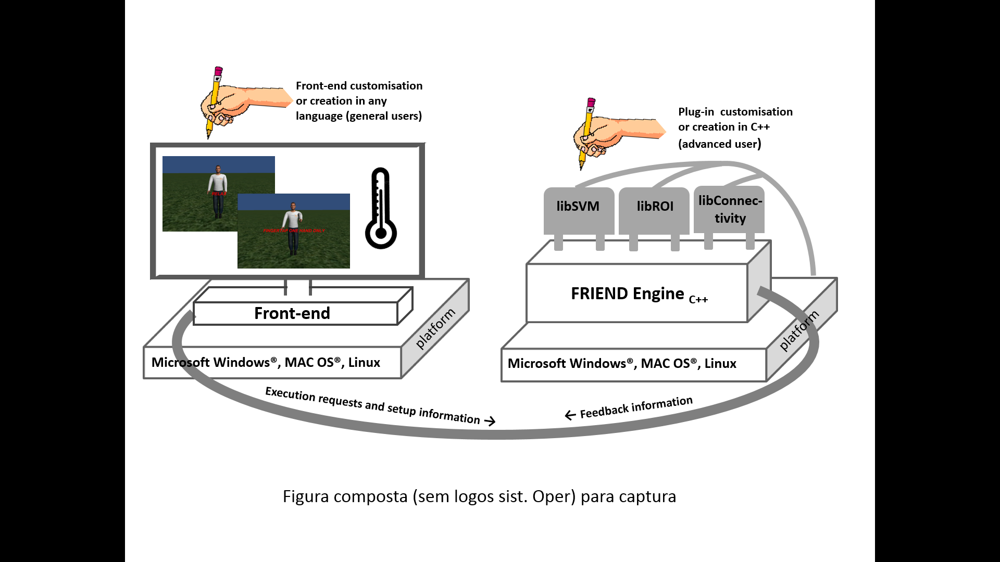

## OVERVIEW AND COMPARISON WITH STANDALONE FRIEND

The first step of a neurofeedback study in Friend Engine Framework is the same as for the standalone version of FRIEND: the correct configuration of the parameters of the study, such as the input directory and the number of volumes in the acquisition run. This configuration should be provided by the frontend application, which gets the input from the operator of the study and passes it to the FRIEND engine (Figure 1). By default, the FRIEND engine application reads the study\_params.txt configuration file located in the same directory of the engine executable file. The study\_params.txt file is exactly the same as for the standalone version of FRIEND. The frontend can pass a whole configuration file through the TCP/IP network communication protocol to the engine, with the command 'READCONFIG' explained in the following section. The next important and vital command, the frontend must pass on, is the plug-in configuration, which comprises the plug-in library filename and the name of the functions that the engine should call at predefined time points, like the name of the function that calculates the feedback information for a volume. These two messages prepare the engine to properly handle the experiment. The next message the frontend should pass is 'PREPROC', which executes the same steps executed in the standalone version of FRIEND after the first configuration window.

> Figure 1. The FRIEND Engine framework comprises three major components: (1) The FRIEND Engine core and (2) plug-ins, written in C++ and operating on the same platform, and (3) the frontend that can be written in any language with sockets support. The TCP/IP communication protocol allows the frontend to be executed on a different computer platform from the FRIEND Engine. Users may customize or write their own frontends. Advanced users can also write their own plug-ins and processing pipelines.

Next, the frontend should send a message indication that the engine can start processing the acquisition run. There are four options, *PIPELINE*, *NBPIPELINE*, *FEEDBACK*, *NBFEEDBACK*, explained in the following section.  It's similar to the click of the *TRAIN* or *FEEDBACK* button in the standalone version of FRIEND. The basic FRIEND functionality is executed by the engine. At specific points of the processing, like the calculation of the feedback, the engine executes the proper plug-in function assigned previously in the plug-in configuration phase. There is no direct communication between the frontend and the plug-in components.

During the acquisition run, the frontend should send 'TEST' messages, querying for neurofeedback information for each volume of the acquisition scan. The engine executes the configured feedback function of the plug-in to get the feedback information and returns it to the frontend. The frontend must interpret this value and properly display that information to the participant of the experiment. Figure 2 depicts that message exchange between the frontend and the engine in the character finger tapping virtual scenario. It includes a new command, 'NEWSESSION', which indicates that the engine should create a new session to work with the frontend. That message is only needed in asynchronous communications as explained in next section.

Friend Engine expects the volume files in exactly the same way as standalone FRIEND does. That fact restricts the list of computers that can run the engine to the list of computers that can receive the volume files from the fMRI scanner in real time. We are studying methods of transferring the volume files to the computer running the engine.

The FRIEND engine runs on Microsoft Windows® (XP or later), Apple Macintosh (OS X 10.8 and above) and Linux (Debian, CentOS 6.4). A mid/high end workstation is required (e.g. PC: Quad-core i7, 8 GB RAM or above, Macintosh: Quad-core Intel Core i5, 8 GB RAM or above).

In original standalone version of FRIEND, FSL (Jenkinson, Beckmann, Behrens, Woolrich, &Smith, 2012)  toolbox commands were encapsulated in a dynamic link Microsoft Windows® library. In FRIEND Engine that interrelationship changed: the FSL toolbox installation was defined as a pre-requisite for the Engine and FSL executables are called using system calls to the operational system. This simplifies FSL upgrades, as they could be executed independently of the Engine code. In the Microsoft Windows® Friend Engine version, our modified source code of the FSL toolbox functionality is embedded in the executable of the FRIEND Engine.

 

> Figure 2. Exchange of TCP/IP network communication protocol between the frontend and the engine, in the character finger tap virtual scenario. The steps with asterisk are called as many times as needed. The first message send is 'NEWSESSION', which indicates that the engine should create a new session to work with the frontend. That message is only needed in asynchronous communications as pointed out in next section.