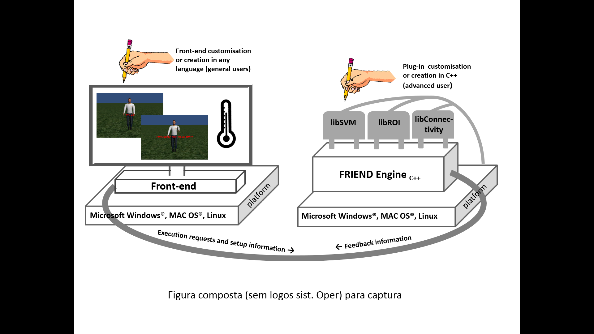
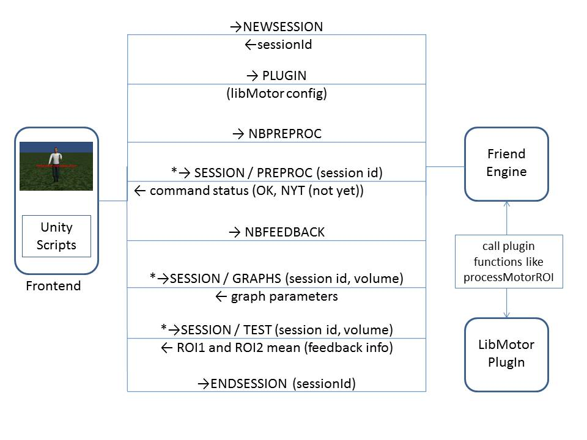

# FRIEND ENGINE FRAMEWORK
> Functional Real-Time Interactive Endogenous Neuromodulation and Decoding

D'Or Institute for Research and Education (IDOR) - Neuroinformatics Workgroup

http://idor.org


## Developer documentation

1. COPYRIGHT AND SOFTWARE
2. LICENSE
3. OVERVIEW AND COMPARISON WITH STANDALONE FRIEND
4. TCP/IP COMMUNICATION
5. PLUG-IN LIBRARY
    1. Train
    2. Test
    3. Initialization
    4. Finalization
    5. Volume
    6. Post Preprocessing
    7. PluginHandler class
6. AVAILABLE PLUG-INS
    1. Code snippets from the LibROI plugin
7. FRONTEND PARAMETERS CONFIGURATION


### 1. COPYRIGHT AND SOFTWARE

The FRIEND software was developed at Cognitive and Behavioral Neuroscience Unit and Neuroinformatics Workgroup, D'Or Institute for Research and Education (IDOR, [http://www.idor.org](http://www.idor.org/))– R. Diniz Cordeiro, 30, 22281-100, Rio de Janeiro, Brazil, Rio de Janeiro, Brazil. The software is registered at the Brazilian agency of patents and trademarks, _Instituto Nacional da Propriedade Industrial_ (INPI – [http://www.inpi.gov.br](http://www.inpi.gov.br/)), under request number 137820. FRIEND's license is open source and free for non-commercial use. It was based on the FSL license and thus follows similar permissions and restrictions.


### 2. LICENSE

FRIEND – Functional Real-Time Interactive Endogenous Neuromodulation and Decoding, Release 1.2 (c) 2012, D'Or Institute of Research and Education, Rede D´Or, Rio de Janeiro, Brazil (the "Software").

The Software remains the property of the D´Or Institute of Research and Education ("the Institute").

The Software is distributed "AS IS" under this Licence solely for non-commercial use in the hope that it will be useful, but in order that the Institute protects its assets for the benefit of its educational and research purposes, the Institute makes clear that no condition is made or to be implied, nor is any warranty given or to be implied, as to the accuracy of the Software, or that it will be suitable for any particular purpose or for use under any specific conditions. Furthermore, the Institute disclaims all responsibility for the use which is made of the Software. It further disclaims any liability for the outcomes arising from using the Software.

The Licensee agrees to indemnify the Institute and hold the Institute harmless from and against any and all claims, damages and liabilities asserted by third parties (including claims for negligence) which arise directly or indirectly from the use of the Software or the sale of any products based on the Software.

No part of the Software may be reproduced, modified, transmitted or transferred in any form or by any means, electronic or mechanical, without the express permission of the Institute. The permission of the Institute is not required if the said reproduction, modification, transmission or transference is done without financial return, and the conditions of this Licence are imposed upon the receiver of the product, and all original and amended source code is included in any transmitted product. You may be held legally responsible for any copyright infringement that is caused or encouraged by your failure to abide by these terms and conditions.

You are not permitted under this Licence to use this Software commercially. Use for which any financial return is received shall be defined as commercial use, and includes (1) integration of all or part of the source code or the Software into a product for sale or license by or on behalf of Licensee to third parties or (2) use of the Software or any derivative of it for research with the final aim of developing software products for sale or license to a third party or (3) use of the Software or any derivative of it for research with the final aim of developing non-software products for sale or license to a third party, or (4) use of the Software to provide any service to an external organisation for which payment is received. If you are interested in using the Software commercially, please contact the Technological Innovation Center, the technology transfer department of the Institute, to negotiate a licence. Contact details are: [innovation@idor.org](mailto:innovation@idor.org) quoting reference SW/001.


### 3. OVERVIEW AND COMPARISON WITH STANDALONE FRIEND

The first step of a neurofeedback study in Friend Engine Framework is the same as for the standalone version of FRIEND: the correct configuration of the parameters of the study, such as the input directory and the number of volumes in the acquisition run. This configuration should be provided by the frontend application, which gets the input from the operator of the study and passes it to the FRIEND engine (Figure 1). By default, the FRIEND engine application reads the study\_params.txt configuration file located in the same directory of the engine executable file. The study\_params.txt file is exactly the same as for the standalone version of FRIEND. The frontend can pass a whole configuration file through the TCP/IP network communication protocol to the engine, with the command 'READCONFIG' explained in the following section. The next important and vital command, the frontend must pass on, is the plug-in configuration, which comprises the plug-in library filename and the name of the functions that the engine should call at predefined time points, like the name of the function that calculates the feedback information for a volume. These two messages prepare the engine to properly handle the experiment. The next message the frontend should pass is 'PREPROC', which executes the same steps executed in the standalone version of FRIEND after the first configuration window.



> Figure 1. The FRIEND Engine framework comprises three major components: (1) The FRIEND Engine core and (2) plug-ins, written in C++ and operating on the same platform, and (3) the frontend that can be written in any language with sockets support. The TCP/IP communication protocol allows the frontend to be executed on a different computer platform from the FRIEND Engine. Users may customize or write their own frontends. Advanced users can also write their own plug-ins and processing pipelines.

Next, the frontend should send a message indication that the engine can start processing the acquisition run. There are four options, *PIPELINE*, *NBPIPELINE*, *FEEDBACK*, *NBFEEDBACK*, explained in the following section.  It's similar to the click of the *TRAIN* or *FEEDBACK* button in the standalone version of FRIEND. The basic FRIEND functionality is executed by the engine. At specific points of the processing, like the calculation of the feedback, the engine executes the proper plug-in function assigned previously in the plug-in configuration phase. There is no direct communication between the frontend and the plug-in components.

During the acquisition run, the frontend should send 'TEST' messages, querying for neurofeedback information for each volume of the acquisition scan. The engine executes the configured feedback function of the plug-in to get the feedback information and returns it to the frontend. The frontend must interpret this value and properly display that information to the participant of the experiment. Figure 2 depicts that message exchange between the frontend and the engine in the character finger tapping virtual scenario. It includes a new command, 'NEWSESSION', which indicates that the engine should create a new session to work with the frontend. That message is only needed in asynchronous communications as explained in next section.

Friend Engine expects the volume files in exactly the same way as standalone FRIEND does. That fact restricts the list of computers that can run the engine to the list of computers that can receive the volume files from the fMRI scanner in real time. We are studying methods of transferring the volume files to the computer running the engine.

The FRIEND engine runs on Microsoft Windows® (XP or later), Apple Macintosh (OS X 10.8 and above) and Linux (Debian, CentOS 6.4). A mid/high end workstation is required (e.g. PC: Quad-core i7, 8 GB RAM or above, Macintosh: Quad-core Intel Core i5, 8 GB RAM or above).

In original standalone version of FRIEND, FSL (Jenkinson, Beckmann, Behrens, Woolrich, &Smith, 2012)  toolbox commands were encapsulated in a dynamic link Microsoft Windows® library. In FRIEND Engine that interrelationship changed: the FSL toolbox installation was defined as a pre-requisite for the Engine and FSL executables are called using system calls to the operational system. This simplifies FSL upgrades, as they could be executed independently of the Engine code. In the Microsoft Windows® Friend Engine version, our modified source code of the FSL toolbox functionality is embedded in the executable of the FRIEND Engine.

 

> Figure 2. Exchange of TCP/IP network communication protocol between the frontend and the engine, in the character finger tap virtual scenario. The steps with asterisk are called as many times as needed. The first message send is 'NEWSESSION', which indicates that the engine should create a new session to work with the frontend. That message is only needed in asynchronous communications as pointed out in next section.


### 4. TCP/IP COMMUNICATION

Table 1 lists the commands expected by the Engine in the TCP/IP communication protocol. There are two types of connections: synchronous (blocked) and asynchronous (non-blocked [NB]) connections. In synchronous connections, the front-end needs to wait until command completion to receive the acknowledge response from the Engine. Asynchronous connections need to be established when the front-end cannot freeze the execution to wait for the acknowledge response, as in virtual reality scenario frontends. This situation happens when a time-consuming command needs to be executed, like "PREPROC" or "TRAIN". In this case, the frontend regularly queries for command termination until the expected response is obtained. To appropriately handle asynchronous connections, a multithread approach with at least two threads is adamant: one, the main thread, that executes all the raw real time processing; and the other, the response thread, which responds to queries of various types of information related to the main thread processing. To make these two threads interoperate, the notion of sessions is introduced. A session is an independent location in the memory of the computer running the engine, capable of storing all the information needed to be sent back to the frontend, such as neurofeedback information and motion corrected volume parameters. The two threads can respond properly to the frontend by a shared access to the same session. The object that handles this TCP/IP communication is the friendEngine object, defined in engine.h file (FES/FES/FRIEND\_Engine/engine.h).


> Table 1. List of commands expected by the Engine in the TCP/IP communication protocol.

| Command | Action |
| --- | --- |
| PREPROC / NBPREPROC | Performs the initial preprocessing steps of FRIEND |
| PIPELINE / NBPIPELINE / FEEDBACK / NBFEEDBACK | Performs the processing of each volume in a run as soon as it becomes available. The difference between the PIPELINE and FEEDBACK commands is that FEEDBACK automatically calculates the feedback values and stores it in a session workspace. |
| GLM / NBGLM | Performs the General Linear Model  (fsl\_glm) calculation of the FSL toolbox calculation |
| FEATURESELECTION / NBFEATURESELECTION | Performs feature selection (see Sato et al., 2013) |
| TRAIN / NBTRAIN | Calls the train function plug-in. |
| TEST | Calls the plug-in feedback calculation function. |
| PLUGIN | Defines the library and the associated plug-in functions to be used in further calls. |
| NEWSESSION | Creates a new session (workspace) in the Engine memory. |
| SESSION/GRAPHPARS | Queries for the movement parameters of a given volume. |
| SESSION/TEST | Returns the feedback information of a volume. |
| SESSION/PREPROC, SESSION/FEEDBACK | Queries if a command, e.g. PREPROC or FEEDBACK has ended. |
| READCONFIG | Sends an entire configuration file associated with the front-end neurofeedback study to set the parameters of the experiment. |


### 5. PLUG-IN LIBRARY

The plug-in file is a dynamic library file (a so file on the Linux system, a dylib file on the Mac OSX system and a dll file in Microsoft Windows®) that implements specific functions called internally by the Engine at specific times during the pipeline. This is a major advantage of the FRIEND Engine, because, when in need of additional features, users can focus on writing just the necessary functionality for the specific needs of their own research. This allows customization of the neurofeedback tool, using encapsulated codes that run additional functionalities from external libraries, leaving the Engine code intact. This characteristic favors usability and code maintenance, because errors in a plug-in library are also encapsulated in that library and do not affect other plug-ins. This framework makes it easier to setup pilot experiments and to explore new hypotheses. We are also planning on maintaining a repository on the Internet for sharing plug-ins and front-ends to facilitate the spread of new technologies.

The plug-in library must implement all the processing needed to calculate the feedback response. The Engine defines six functions that are called at predefined time points during the pipeline execution. Not all of those six functions must be implemented in a plug-in library, just the ones necessary to properly calculate the feedback information. We recommend advanced users to code those functions in C/C++ because that avoids compatibility errors during the execution of the plug-in's functions by the engine. The main parameter of these functions is an object of the studyParameters class type, defined in the file vardb.cpp (FES/FES/PlugIn/vardb.cpp), which encloses all the information used by the processing pipeline to correctly identify the files, directories and expected number of volumes. Another important parameter passed to the plug-in is a pointer referencing the dynamically allocated memory created by inside the initialization function of the plug-in to be used for temporary calculations. The list of functions a plug-in can define are:

####  5.1. TRAIN

Executed when the front-end issues the TRAIN command. Normally, this function is used to analyze a complete data set (e.g. a training run). This function is generally quite time demanding, and is therefore not a "real-time" operation. It is normally called at the end of the acquisition of the training run. This function builds a model based on the training data that can be used on a subsequent classification run.

####    5.2. TEST

Executed when the Engine needs to calculate the feedback value for a given volume. There are two predefined values that the Engine returns to the front-end: information about the condition of the processed image volume indicating a specific type of image volume classification (useful for multi voxel patter analysis [MVPA]), and the feedback information value. The interpretation of these two variables is left to the front-end, which must implement how this information will be passed to the participant.

####    5.3. INITIALIZATION

Called after the engine reads information from the study configuration file (see Sato et al., 2013). All the memory data structure used by the plug-in must be initialized here. A pointer reference for this data structures has to be returned in the function argument. This reference will be used in further plug-in function calls issued by the FRIEND Engine.

####    5.4. FINALIZATION

Called right before ending the processing of a session. All the memory data structure allocated in the Initialization function must be destroyed here.

####    5.5. VOLUME

Called before the pre-processing of each volume.

####    5.6. POST PREPROCESSING

Called after the pre-processing of each volume.

####    5.7. PluginHandler class

The class PluginHandler, located in FES/FES/FRIEND\_Engine/PlugInHandler.h is responsible for handling the interface between engine and the plug-ins. The function definitions are also located in this header file and listed below :

```c

// plug in function pointer definitions
typedef int(*InitializationFunction)(studyParams&vardb, void *&userData);
typedef int(*TrainFunction)(studyParams&vardb, void *&userData);
typedef int(*TestFunction)(studyParams&vardb, int index, float &classnum, float &projection, void *&userData);
typedef int(*FinalizationFunction)(studyParams&vardb, void *&userData);
typedef int(*VolumeFunction)(studyParams&vardb, int index, char *fileName, void *&userData);
typedef int(*AfterPreprocessingFunction)(studyParams&vardb, int index, char *fileName, void *&userData);

```


### 6. AVAILABLE PLUG-INS

The FRIEND Engine distribution comes with four plug-ins: one for the SVM pipeline (libBrainDecoding), using the libSVM library (Chang &Lin, 2011); one for the ROI pipeline (libROI), used in the Matlab and the Medieval frontend examples; one for the functional connectivity between two ROIs (libConnectivity) and one (libMotor) that extracts ROI information from two ROIs located in the motor cortex area (left and right), used in the character finger tapping virtual scenario. The source code of these plug-ins are located in the directory FES/FES/PlugIn.

In table 2 we list the functions implemented in the libROI plug-in. We recommend the users that want or need to write their plug-in to start studying the files **ROIPlugIn.cpp** and **ROIPlugIn.h** , in FES/FES/PlugIn/ROIbasePlugIn directory


> Table 2. Functions implemented in the libROI plug-in.

| Plug-in | LibROI |
| --- | --- |
| initializeROIProcessing | Initialization function that creates the data structures necessary for processing ROIs and transforms the ROI MNI mask to native space. |
| processROI | Feedback function that calculates the percent signal change of a ROI in the current volume compared to the mean activation of a baseline block. |
| finalizeROIProcessing | Finalization function that destroys all data structures created in the initialization function. |

#### Code snippets from the LibROI plugin

Here we present code snippets from the libROI plug-in used in the Matlab frontend and in the Medieval virtual scenario frontends of the distribution. The code snippet 1 contains the function processROI, which calls a class method that actually performs the calculations. It also demonstrates the use of some methods of the studyParameters class and volume manipulation with functions used within the FSL source code. Other functions and objects, like the one that calculates the mean of a ROI are also shown.

The targetValue variable used at the end of the method processVolume is read within the initializeROIProcessing function, presented in code snippet 2. The studyParams variable grants the plug-in library access to the setup configuration information of the study contained in the studyparams.txt file. Users can create their own configuration information in the configuration file and read it in the plug-in initialization function.

**Code snippet 1**. Main function of the libROI plug-in that calculates the feedback value.

```c

// libROI Plug-in function that calculates the feedback value that the engine will pass to the frontend
int roiProcessing::processVolume(studyParams &vdb , int index , float &classnum , float &projection)
{
   char processedFile[200];

   int idxInterval = vdb.interval.returnInterval(index);

   volume <float> v ;

   // gets the motion corrected and Gaussian smoothed file
   vdb.getMCGVolumeName(processedFile , index);

   read\_volume(v , string(processedFile));

   // if in baseline condition, adds current image to the previous sum image
   classnum = vdb.getClass(index);

   projection = 0 ;

    if ( vdb. interval. isBaselineCondition ( index ))

    {

      if ( vdb. interval. intervals [idxInterval]. start == index )
          meanbaseline = v ;
      else meanbaseline += v ;

      // when finishing adding images on baseline condition block,
      // divide the sum image by the size of the block to create the
      // mean volume

      if ( vdb.interval.intervals[idxInterval].end == index )
      {
         meanbaseline = ( vdb.interval.intervals[idxInterval].end 
                       - vdb.interval.intervals[idxInterval].start + 1);

         // obtain ROI mean value. 
         // The MeanCalculation object variable was initialized previously with the 
         // ROI mask in Initialization function.
         //
         // calculateMeans method obtains the mean for each ROI in the current volume
         meanCalculation.calculateMeans(meanbaseline);

         // Calculates the mean of the ROI for the current mean volume.
         lastBaselineValue = meanCalculation.means[0];

      }

    }
    else // task condition. Taking the mean of the volume and calculating the PSC
    {
      meanCalculation.calculateMeans(v);

      // Percent signal change calculation
      projection = PSC(meanCalculation.means[0], lastBaselineValue);

      // Divide feedback value by user-defined target value. The
      // front-end will use the feedback value for neurofeedback
      // display

      projection = projection / targetValue ;
      fprintf(stderr ,"Projection value = %f\n" , projection);
    }
    return 0 ;
}

// calculate the percent signal change value
float roiProcessing::PSC(float value , float base)
{
    return ( base ) ? (( value - base ) / base): 0 ;
}

// plugin function for calculationg feedback value
DLLExport processROI(studyParams &vdb , int index , float &classnum , float &projection , void *&userData )
{
   roiProcessing *roiVar = ( roiProcessing *) userData ;
   roiVar -> processVolume(vdb , index , classnum , projection);
   return 0 ;
}

```


**Code snippet 2**. Initialization function of the libROI plug-in.
```c

// initializes the object variables. This function brings the mni mask to subject space
int roiProcessing::initialization(studyParams &vdb)
{
    // verifies if the configuration file was read
    if(vdb.readedIni.IsEmpty())
   {
       fprintf(stderr ,"the studyparams.txt file was not read.\n");
       return 1 ;
   }

    // reads the specific plugin information. readedIni object contains all the information from the
   // configuration file
   strcpy(vdb.mniMask , vdb.readedIni.GetValue("FRIEND" ,"ActivationLevelMask"));
   strcpy(vdb.mniTemplate , vdb.readedIni.GetValue("FRIEND" ,"ActivationLevelMaskReference"));
   targetValue = vdb.readedIni.GetDoubleValue("FRIEND" ,"ActivationLevel");
   int masktype = vdb.readedIni.GetLongValue("FRIEND" ,"ActivationLevelMaskType");
   fprintf(stderr ,"mnimask = %s\n" , vdb.mniMask);
   fprintf(stderr ,"mnitemp = %s\n" , vdb.mniTemplate);
   fprintf(stderr ,"masktype = %d\n" , masktype);
   
    if (( fileExists ( vdb. mniMask )) &&( fileExists ( vdb. mniTemplate )) &&( masktype == 2 ))
    {
      char outputFile[500], prefix[500]="_RFI2" , name[500];
      extractFileName(vdb.mniMask , name);
      for ( int t = 0 ; t <strlen ( name ); t ++)
      if ( name[t] =='.') name[t]= '_' ;
      sprintf(outputFile ,"%s%s%s.nii" , vdb.inputDir , name , vdb.trainFeatureSuffix);
      fprintf(stderr ,"Calculating the native template %s\n" , outputFile);

      // bringing mni mask to subject space
      MniToSubject(vdb.rfiFile , vdb.mniMask , vdb.mniTemplate , outputFile , prefix);

      // loads the reference mask
      meanCalculation.loadReference(outputFile);
    }
    else if((fileExists(vdb.mniMask))&&(masktype == 1))
    {
          // loads the reference mask
          fprintf(stderr ,"Loading native space mask %s\n" , vdb.mniMask);
          meanCalculation.loadReference(vdb.mniMask);
    }

   lastBaselineValue = 0 ;
   return 0 ;
}

// plugin function for initializating the roi processing object

DLLExport initializeROIProcessing(studyParams &vdb , void *&userData)

{

   roiProcessing *roiVar = new roiProcessing ;

   roiVar -> initialization(vdb);

   userData = roiVar ;

    return 0 ;

}
```

The following code snippets are from the Matlab frontend showing how information must be exchanged with the engine via a non-blocked TCP/IP communication in the ROI processing pipeline. The first command issued is the "NEWSESSION" command that creates a new session in memory and returns the session id that uniquely identifies the newly created session. As already explained in the main paper, a session is an independent location in the memory of the computer running the engine, capable of storing all the information needed to be sent back to the frontend, such as neurofeedback information and motion corrected volume parameters. We use the Matlab functions fprintf and fgetl to send and receive, respectively, messages via TCP/IP communication.

The variables mainThread and responseThread, presented in the following code snippets, are two Matlab TCP/IP objects. The connection established through the mainThread variable is the first made and lasts until the end of the acquisition run processing. The principal commands are sent through that connection.  The connection established through the responseThread is temporary. Each time an information is needed, such the feedback information for a specific volume, the connection is opened and after the information is acquired, the connection is closed.

**Code snippet 3**. Creating a new session in the engine
```matlab

fprintf(mainThread ,'NEWSESSION');

% reading session id
sessionID = fgetl(mainThread);

% reading acknowledge
response = fgetl(mainThread);

```

The next command issued by the frontend is the "PLUGIN", which sends the plug-in library filename and the names of the functions that the engine must call to accomplish the objective of the neurofeedback study. This list of function names must be sent in a pre-specified order (train, test, initialization, finalization, volume and post-processing as indicated by the Matlab % commentary directives to the right of each programming line). Not implemented functions must be specified as "no" in the place where the name of the function should be present.


**Code snippet 4**. Configuring the plugin to be used in the experiment

```matlab

% sending the PLUG-IN command and parameters
fprintf(mainThread ,'PLUGIN');
fprintf(mainThread ,'libROI');
fprintf(mainThread ,'no'); % train function
fprintf(mainThread ,'processROI'); % test function
fprintf(mainThread ,'initializeROIProcessing'); % initialization function
fprintf(mainThread ,'finalizeProcessing'); %finalization function
fprintf(mainThread ,'no'); % volume function
fprintf(mainThread ,'no'); % post preprocessing function

% getting the acknowledge
response = fgetl(mainThread);

```


The next command is "NBPREPROC", which initiates the preprocessing steps of the FRIEND pipeline in asynchronous (non-blocked) mode. Note that after this command, the front-end has to regularly query the Engine for the termination of this step.

**Code snippet 5.** Starting the PREPROC asynchronously

```matlab

% sending PREPROC non-blocked command
fprintf(mainThread ,'NBPREPROC');

% getting the acknowledge
response = fgetl(mainThread);

```

**Code snippet 6**. Getting a feedback value

```matlab

% open a communication channel with the engine
fopen(responseThread);

% sending the session command to create a new workspace
fprintf(responseThread ,'SESSION');

% sending the session id
fprintf(responseThread ,'%s' , sessionID);

response = fgetl(responseThread);

% sending the TEST sub-command
fprintf(responseThread ,'TEST');

% sending the volume index of the feedback value
fprintf(responseThread ,'%d' , actualVolume);

% getting feedback information
class = str2double(fgetl(responseThread));
percentage = str2double(fgetl(responseThread));

% getting acknowledge
response = fgetl(responseThread);

% closing the connection
fclose(responseThread);

```


Next, the "NBFEEDBACK" command is sent, initiating the processing of the volumes of the actual run. The front-end client issues various SESSION/GRAPHPARS commands through the responseThread variable to query for translation and rotation parameters of each motion corrected volume to be presented in graphs placed in the interface, and SESSION/TEST commands to control the thermometer to be presented to the participant, as showed in code snippet 5. If all the volume files in the run were processed, the SESSION/GRAPHPARS command returns an "END" token, indicating the termination of the feedback process.


**Code snippet 7**. Example of how to use the SET command
```matlab

% changing the mask type to native space
fprintf(mainThread ,'SET');
fprintf(mainThread ,'ActivationLevelMaskType');
fprintf(mainThread ,'1');
response = fgetl(mainThread);

% changing the mask to the generated by the funcional localizer run
fprintf(mainThread ,'SET');
fprintf(mainThread ,'ActivationLevelMask');
fprintf(mainThread ,'glmdirtstats\_features\_RUN01\_bin');
response = fgetl(mainThread);

% changing the mask to the generated by the funcional localizer run
fprintf(mainThread ,'SET');
fprintf(mainThread ,'Prefix');
fprintf(mainThread ,'outputdirRUN02/DRIN-');
response = fgetl(mainThread);

```

> **Code snippet 7** show how to use the SET command, one of the commands to change pieces of the read in memory study\_params.txt. In this snippet, the Matlab frontend changes the ActivationLevelMaskType to 1, indicating that the mask informed in the variable ActivationLevelMask is in native space. It also changes this mask, to the binary version of the result of the FEATURESELECTION command. The last SET command changes the Prefix variable, indicating that the volumes of the actual RUN should be find in RUN02 directory. The _glmdir_ and _outputdir_ are replaced in the engine for the actual values. _glmdir_ is replaced by the glm output directory, inside the subject directory  (in the engine distribution is FES/FES/TestData/SUBJ002/glm). The _outputdir_ is replaced by the subject directory(in the engine distribution is FES/FES/TestData/SUBJ002).


### 7. FRONTEND PARAMETERS CONFIGURATION

In all these game examples, there is, in the engine directory, a ready configured studyparams.txt file, that is read by default by the engine and all the volume files already placed into the input directory referenced by the studyparams.txt file. To read the volume files in a real-time online setup, a researcher needs to configure the arrival of images in the input directory in the same way as for the standalone version of FRIEND.
