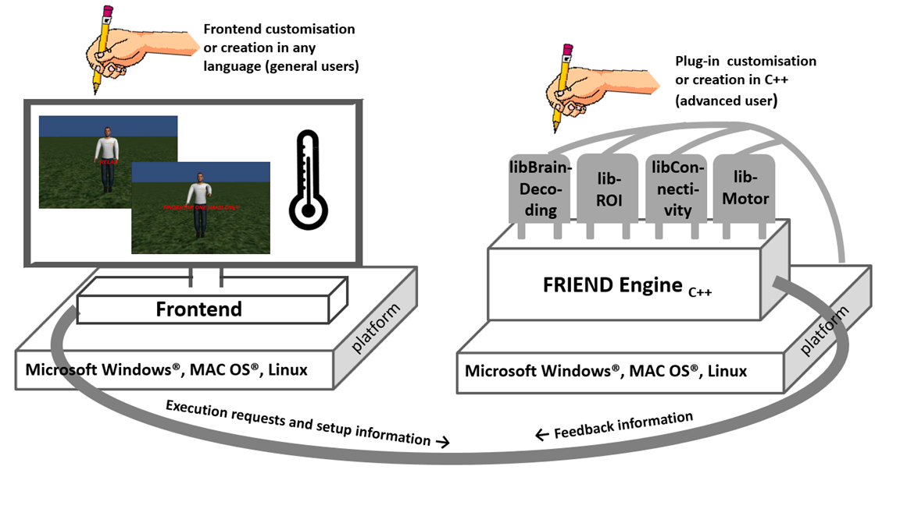

# 1. INTRODUCTION

The FRIEND Engine Framework is a new implementation of the FRIEND software, a fMRI neurofeedback processing package that has been on the NITRC website since Oct 2013. Its aim is to create a cross-platform framework for a real time neurofeedback processing pipeline that permits interoperability with other applications (e.g.: games engines for the creation of virtual scenarios) and the inclusion of new processing methods through the use of plug-ins provided with the distribution or developed and shared by FRIEND engine users.

The FRIEND engine framework consists of three main parts (Figure 1). The first one is the front end that is responsible for presenting the neurofeedback information to the subject. The second one is the core engine, a multithread application server that listens to a TCP/IP port for request commands issued by the front end and performs the associated command processing. The third one is the plug-in file, a dynamic library file (a .so file Linux file or a Mac OSX dylib file) that implements specific functions that are called internally by the engine at specific times during the pipeline. The engine and plug-in are written in C++, whereas the front end can be written by the user/researcher in any language capable of issuing TCP/IP messages. They can execute on different machines and operational systems as they communicate through a TCP/IP protocol.

> Figure 1. The FRIEND Engine framework comprises three major components: (1) The FRIEND Engine core and (2) plug-ins, written in C++ and operating on the same platform, and (3) the frontend that can be written in any language with sockets support. The TCP/IP communication protocol allows the frontend to be executed on a different computer platform from the FRIEND Engine. Users may customize or write their own frontends. Advanced users can also write their own plug-ins and processing pipelines.

Third-party software is used: the FSL toolbox (http://fsl.fmrib.ox.ac.uk/fsl/fslwiki/), the Alglib library (http://www.alglib.net/), libSVM (http://www.csie.ntu.edu.tw/~cjlin/libsvm/) and SimpleINI (https://github.com/brofield/simpleini).

**Domain**: Clinical Neuroinformatics, MR, Computational Neuroscience