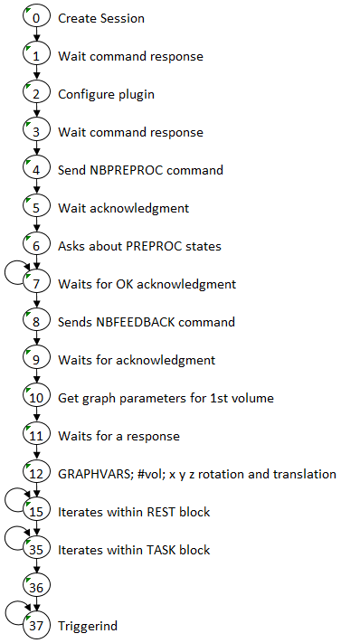
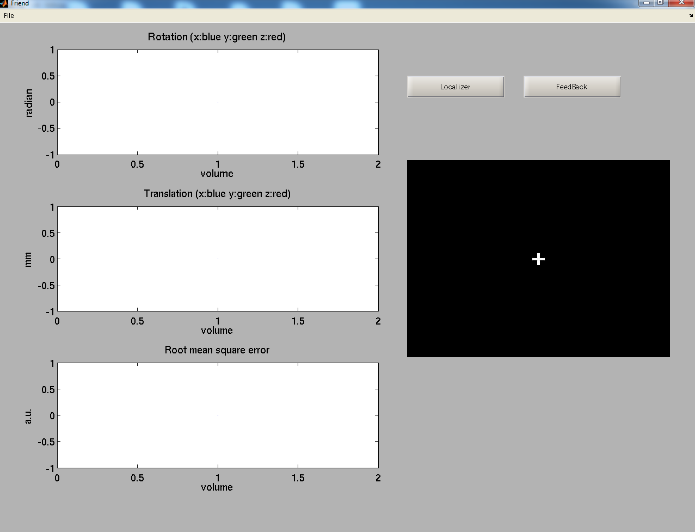
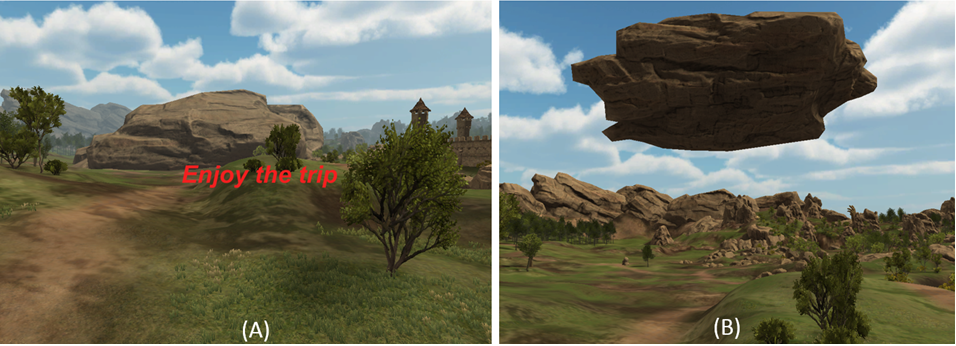

## FRONTENDS

* MATLAB
* Unity
* Presentation
* Python

### FRONTEND STATE MACHINE

Frontend processing can assume different states as shown on figure below.



<a name="matlab"></a>
### MATLAB FRONTEND

FriendMotor

> [Frontends\Matlab\FriendMotor.m](https://github.com/InstitutoDOr/FriendENGINE/blob/master/frontends/Matlab/FriendMotor.m)


FriendRoi

> [Frontends\Matlab\FriendRoi.m](https://github.com/InstitutoDOr/FriendENGINE/blob/master/frontends/Matlab/FriendRoi.m)


Useful information can be found on the manual of the FRIEND standalone version on the NITRC website.

The frontend expects the engine to be already executing on localhost by default. For information about the plug-in or to modify IP and port see lines:

```matlab
host='127.0.0.1';
port=5678;
fprintf(mainThread, 'PLUGIN');
fprintf(mainThread, 'libROI');
```



Warning for Matlab academic license: as the Instrument Control Toolbox for TCP/IP communication is not present, the following error might occur:

```matlab
>> Friend

Undefined function 'tcpip' for input arguments of type 'char'.

Error in Friend>Friend\_OpeningFcn (line 100)
mainThread = tcpip(host, port);
Error in gui\_mainfcn (line 221)
    feval(gui\_State.gui\_OpeningFcn, gui\_hFigure, [],
    guidata(gui\_hFigure), varargin{:});
Error in Friend (line 42)
    gui\_mainfcn(gui\_State, varargin{:});
```

This frontend is a two pass execution. In the first execution, click in localizer button, and a localizer run, will be executed, creating a roi file derived from the GLM calculation. After the executtion is finished, close the frontend and execute it again, clicking in the feedback button this time. It will use the ROI file to calculate the feedback information.


<a name="unity"></a>
### UNITY ENVIRONMENT

Unity software is required (https://unity3d.com).

#### MEDIEVAL FRONTEND

The Big Environment Pack (http://u3d.as/content/philipp-schmidt/big-environment-pack/2T9) must be installed:


> Unity > File > Assets > Import Package > BIG Environment PackV1.unitypackag > Done

The frontend expects the engine to be already executing on localhost by default. For other IP and port modify:

[frontends\Unity\Medieval\Assets\Scripts\movimentaPrimeiroBloco.cs](https://github.com/InstitutoDOr/FriendENGINE/blob/master/frontends/Medieval/Assets/Scripts/movimentaPrimeiroBloco.cs)

```c#
private String HostData="127.0.0.1";
private Int32 Port=5678;
```

Information about the plug-in used is at:
[frontends\Unity\Medieval\Assets\Scripts\FriendEngineComm.cs](https://github.com/InstitutoDOr/FriendENGINE/blob/master/frontends/Medieval/Assets/Scripts/FriendEngineComm.cs)

```c#
mainThread.writeSocket ("PLUGIN");
mainThread.writeSocket ("libROI");
```

To open the Medieval frontend:

> Unity > Open Project > Open Other > [FES\frontends\Unity\Medieval](https://github.com/InstitutoDOr/FriendENGINE/tree/master/frontends/Medieval) directory > Done

This frontend is a medieval virtual reality scenario in which the avatar, i.e. the participant, hovers over a path and stops in predetermined locations, blocked by a massive rock. Using the same finger tapping neurofeedback procedure exemplified in the Matlab® frontend (alternating rest and finger tapping blocks), and the same libROI plug-in, the feedback information to the participant is now given in a different way. As the participant moves across the scenario and stops right before the rock, he needs to perform the finger tapping task as instructed (as quickly as possible). If the percentage BOLD signal change returned by the engine reaches a predefined threshold the rock levitates, thus unblocking the path so that the journey continues (see figure below). If the threshold is not reached, the player stays at the same location until the next try, i.e. the next activation block. This scenario was constructed using objects from the iTween and iTween path editor (http://itween.pixelplacement.com/index.php) and the Big Environment pack, available in the Unity




#### FINGERTAP FRONTEND

Unity ? Open Project ? Open Other ? [FES\frontends\Unity\FingerTap](https://github.com/InstitutoDOr/FriendENGINE/tree/master/frontends/FingerTap) directory ? Done

The frontend expects the engine to be already executing on localhost by default. For other IP and port modify:

[Frontends\Unity\FingerTap\Assets\Scripts\motorScript.cs](https://github.com/InstitutoDOr/FriendENGINE/blob/master/frontends/FingerTap/Assets/Scripts/motorScript.cs)

```c#
private String HostData = "127.0.0.1;
private Int32 Port = 5678
```

Information about the plug-in used is at:

[Frontends\Unity\FingerTap\Assets\Scripts\MotorComm.cs](https://github.com/InstitutoDOr/FriendENGINE/blob/master/frontends/FingerTap/Assets/Scripts/FriendEngineComm.cs)

```c#
mainThread.writeSocket ("PLUGIN");
mainThread.writeSocket ("libMotor");
```

The finger tapping experiment intercalates blocks of rest and finger tapping. The participant is asked to perform finger tapping with either their left or right hand, alternating with resting blocks. Two ROIs located in the primary motor cortex area of the left and right cerebral hemisphere are used by the libMotor plug-in to calculate the percent BOLD signal change in the left and right ROIs in the same way as the libROI plug-in in the Medieval example. The FingerTap frontend compares the feedback values between both ROIs in such a way that the greater one will inform which hand of the avatar, showed by the frontend, will perform the finger tapping animation. If successfully performed, this conveys a clear impression that the participant is controlling the hands of the avatar with his/her own hands. The avatar and hand animations were implemented using the VR Hands Unity asset ( [https://serrarens.nl/passervr/downloads/vr-hands/](https://serrarens.nl/passervr/downloads/vr-hands/)).


<a name="python"></a>
#### PYTHON FRONTEND (Python 2.7)

The frontend expects the engine to be already executing on localhost by default. For information about the plug-in or to modify IP and port see:

[Frontends\Python\frontend.py](https://github.com/InstitutoDOr/FriendENGINE/blob/master/frontends/Python/frontend.py)

```python
mainThread.send('PLUGIN\n');
mainThread.send('libROI\n');
```

Execution of the frontend should follow the steps:

1. Execute:  python frontendROI.py 1
2. A functional localization processing is executed
3. Execute:  python frontendROI.py 2 to perform neurofeedback processing

**Note : All frontends listed here are example frontends. To be used in a real experiment, you need to handle all the presentation of stimuli and time issues.**