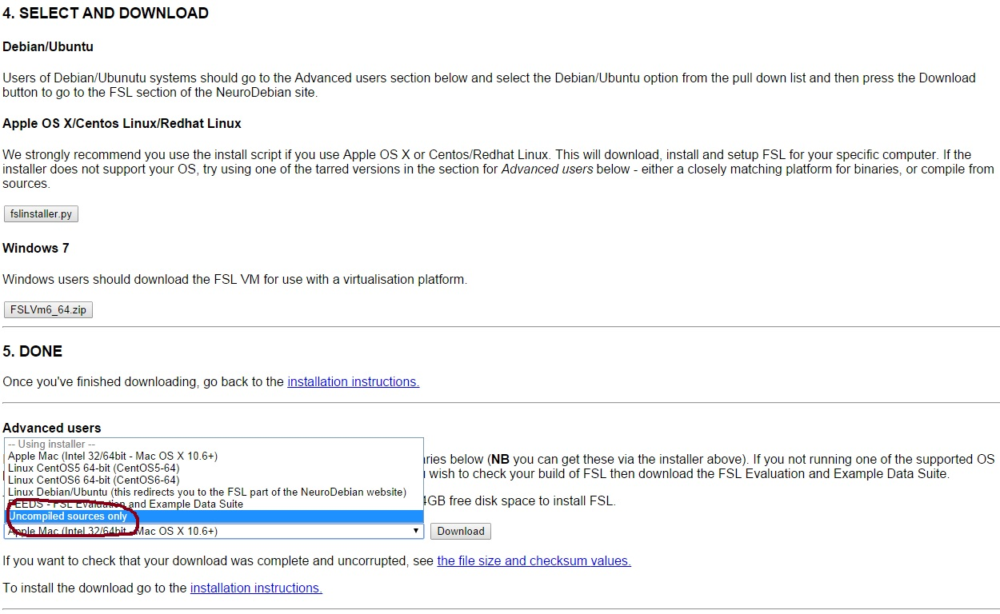

## INSTALLING FSL 

### NON-WINDOWS PLATFORMS

To run FRIEND Engine, the FSL software ( [http://fsl.fmrib.ox.ac.uk/fsldownloads/](http://fsl.fmrib.ox.ac.uk/fsldownloads/)) must be installed. Please, explicitly check the installed directories to be sure the option you selected allowed the installation of FSL source code. If not available, FRIEND Engine will not be able to compile. The next section resumes the correct installation and preparation for Debian/Ubuntu machines

### Debian/UBUNTU

1. Installing NeuroDebian

```shell
wget -O- [http://neuro.debian.net/lists/trusty.us-ca.full](http://neuro.debian.net/lists/trusty.us-ca.full)| sudo tee /etc/apt/sources.list.d/neurodebian.sources.list
sudo apt-key adv --recv-keys --keyserver hkp:// [pgp.mit.edu:80](http://pgp.mit.edu/)2649A5A9
sudo apt-get update
sudo apt-get install fsl-complete
```

2. Download FSL uncompiled sources

Download from [http://fsl.fmrib.ox.ac.uk/fsldownloads/fsldownloadmain.html](http://fsl.fmrib.ox.ac.uk/fsldownloads/fsldownloadmain.html)




Extract the downloaded file in /usr/local/fsl

Install g++, git and additional libraries

```shell
sudo apt-get install g++
sudo apt-get install git
sudo apt-get install libz-dev
sudo apt-get install libpng12-dev
sudo apt-get install libgd-dev
```

3. Change some environment variables

```shell
export LD\_LIBRARY\_PATH=$LD\_LIBRARY\_PATH:/usr/lib/fsl/5.0
export PATH=$PATH:/usr/lib/fsl/5.0
export FSLDIR=/usr/local/fsl
export FSLOUTPUTTYPE=NIFTI\_GZ
ln -s /usr/lib/fsl/5.0 /usr/local/fsl/bin
```
